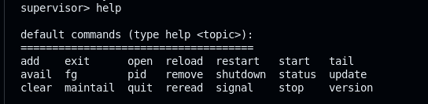

the goal is to create a job control for linux

the project is constitued of 2 parts

taskmasterd
    - Get a config file
    - Launch Process
    - Stop Process
    - Manage Process

taskmasterctl
    - Shell CLI to communicate with taskmasterd with UNIX Socket
    